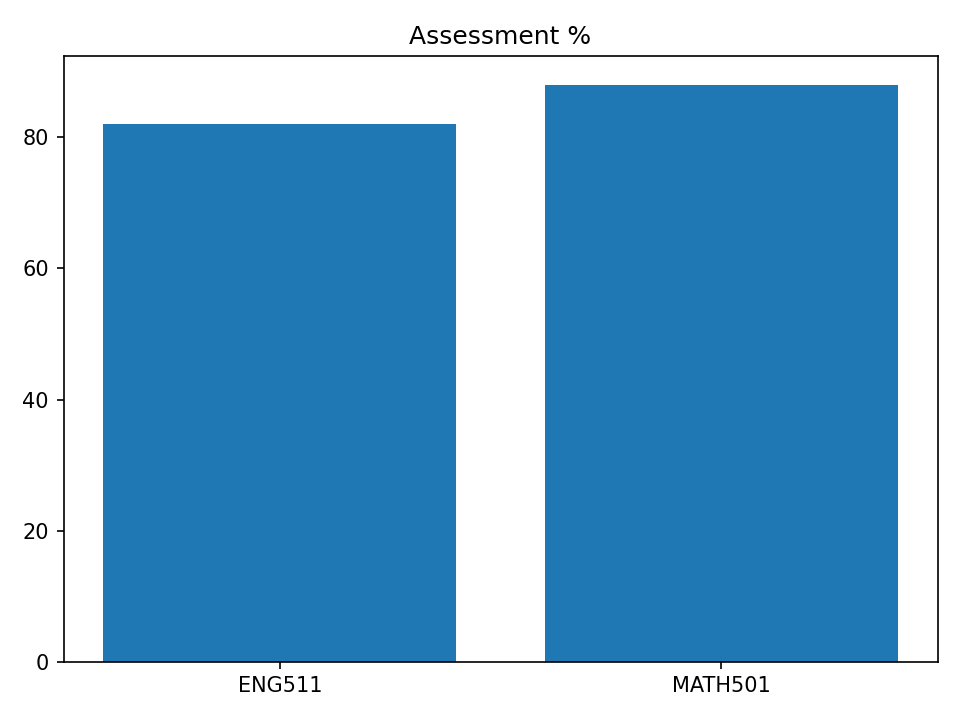

> **Report provenance**
> mode: **groq-llm** • model: `llama-3.3-70b-versatile` • temperature: 0.2
> generated_at: 2025-09-08T17:24:38

# รายงานผลการเรียน (1-2025)
**นักเรียน:** Anya Chaiyasit (S001)  |  **ห้อง:** M5/1
**อัตราเข้าเรียนเฉลี่ยโดยประมาณ:** 100.0%

นักเรียน Anya Chaiyasit มีผลการเรียนในเทอม 1-2025 ดังนี้
- เปอร์เซ็นต์ผลการเรียนในรายวิชา ENG511 อยู่ที่ 82% และ MATH501 อยู่ที่ 88%
- อัตราการเข้าร่วมเรียนและมาตรงเวลาอยู่ที่ 100% ทั้งสองวิชา
- คะแนนเฉลี่ยการบ้านในรายวิชา ENG511 อยู่ที่ 8.0 และ MATH501 อยู่ที่ 9.0

จุดแข็งของ Anya ได้แก่
1. อัตราการเข้าร่วมเรียนและมาตรงเวลาที่ 100% ทั้งสองวิชา
2. คะแนนเฉลี่ยการบ้านที่สูงในรายวิชา MATH501

โอกาสพัฒนาของ Anya ได้แก่
1. ปรับปรุงคะแนนการประเมินในรายวิชา ENG511 ให้สูงขึ้น
2. พยายามรักษาความต่อเนื่องในการมีคะแนนเฉลี่ยการบ้านที่สูงในรายวิชาทั้งสอง

คำแนะนำสำหรับ Anya
1. พยายามเพิ่มความเข้าใจและความสนใจในรายวิชา ENG511 เพื่อเพิ่มคะแนนการประเมิน
2. ตั้งเป้าหมายในการรักษาคะแนนเฉลี่ยการบ้านที่สูงและพยายามปรับปรุงคะแนนให้สูงขึ้นในรายวิชาทั้งสอง

_Generated by Groq • model=llama-3.3-70b-versatile • temp=0.2_