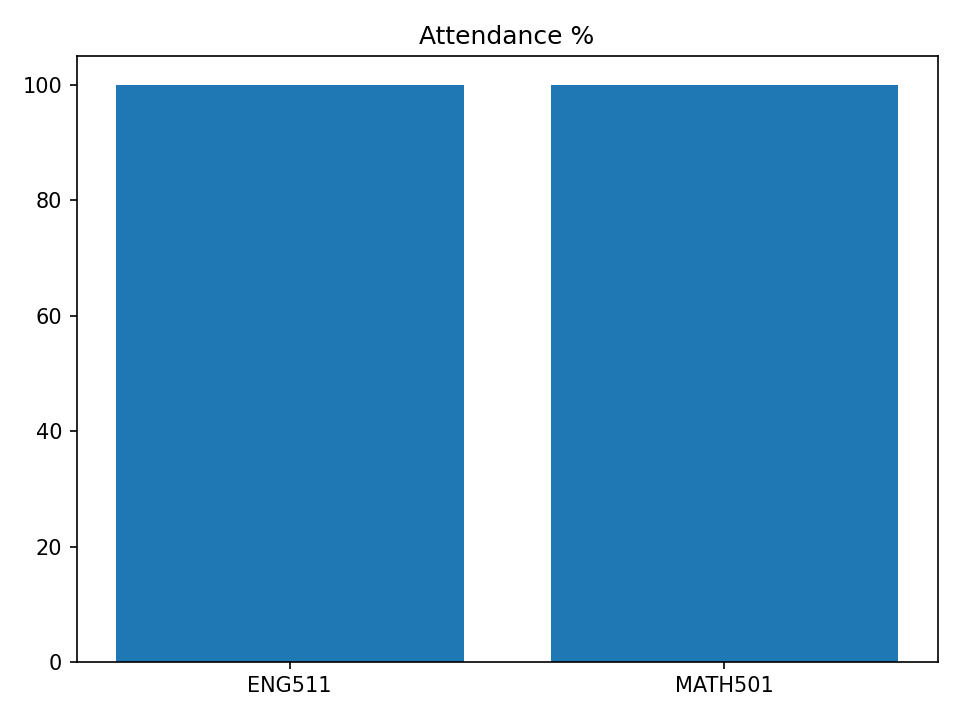
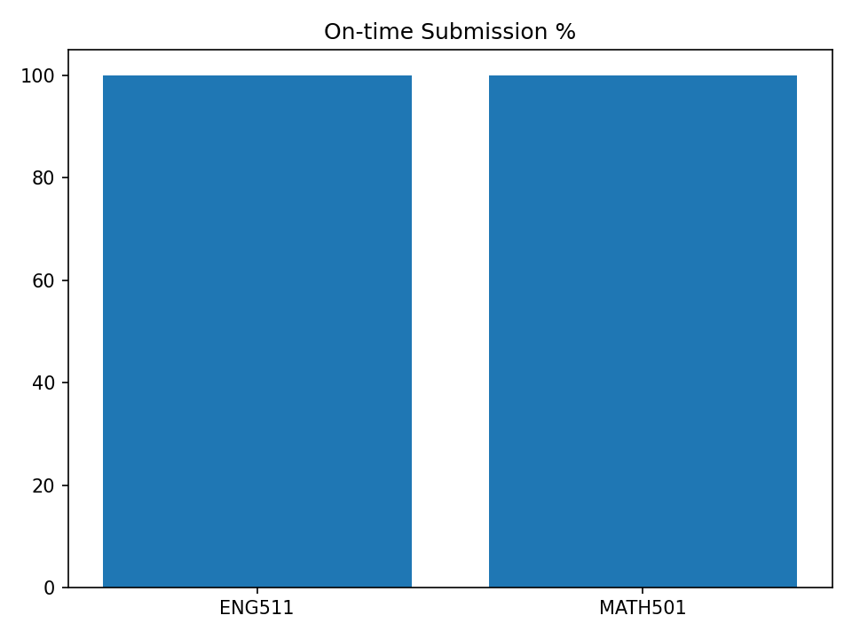

> **Report provenance**
> mode: **groq-llm** • model: `llama-3.3-70b-versatile` • temperature: 0.2
> generated_at: 2025-09-05T08:56:50

# รายงานผลการเรียน (1-2025)
**นักเรียน:** Napat Siripong (S002)  |  **ห้อง:** M5/1
**อัตราเข้าเรียนเฉลี่ยโดยประมาณ:** 0.0%

นักเรียน Napat Siripong มีผลการเรียนในเทอม 1-2025 ดังนี้

- เปอร์เซ็นต์การเข้าร่วมเรียนทั้งในชั้นเรียนและในรายวิชา MATH501 เท่ากับ 0% ซึ่งเป็นผลลัพธ์ที่ต้องได้รับการปรับปรุง
- ไม่มีข้อมูลคะแนนเฉลี่ยการบ้าน (NaN) ในรายวิชา MATH501 ซึ่งเป็นข้อมูลสำคัญที่ควรได้รับการแก้ไข

จุดแข็ง:
- ไม่มีข้อมูลที่บ่งชี้ถึงจุดแข็งของนักเรียน Napat ในข้อมูลที่ให้มา

โอกาสพัฒนា:
- ปรับปรุงการเข้าร่วมเรียนให้ถึง 100% เพื่อไม่ให้พลาดโอกาสในการเรียนรู้
- ต้องมีการบ้านหรืองานที่ได้รับมอบหมายเพื่อประเมินความเข้าใจและทักษะของนักเรียน

คำแนะนำ:
- ตั้งเป้าหมายในการเข้าร่วมชั้นเรียนทุกครั้งและเตรียมตัวให้พร้อมสำหรับการเรียนรู้
- พูดคุยกับครูหรือที่ปรึกษาเพื่อแก้ไขปัญหาและหาวิธีการปรับปรุงการเรียนให้ดีขึ้น

_Generated by Groq • model=llama-3.3-70b-versatile • temp=0.2_